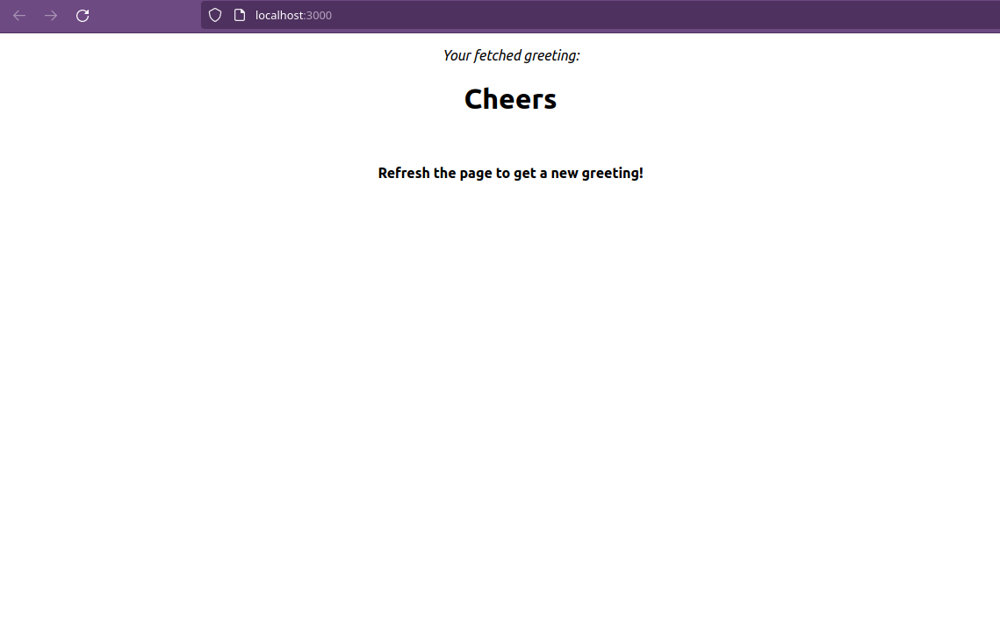

# hello-rails-front-end
This is the front-end part of a two-part project. This repo contains the user interface made with React.
You can find the back end part [here](https://github.com/eduardosancho/hello-rails-back-end).

## Preview

### Clone this repo
~~~ bash
git clone https://github.com/eduardosancho/hello-react-front-end.git
~~~

### Getting started
Install dependencies:
~~~ bash
npm install
~~~

Start server at port 3000:
~~~ bash
npm start
~~~

## Collaborators
👤 **Eduardo**

 Platform | Badge |
 --- | --- |
 **GitHub**  | [@eduardosancho](https://github.com/eduardosancho)
 **Twitter** | [@sanchitoblog](https://twitter.com/sanchitoblog)
 **LinkedIn** | [Eduardo Sancho Solano](https://www.linkedin.com/in/eduardo-sancho-solano/)

 
## Show your support

Give a ⭐️ if you like this project!

## Acknowledgments

The ideas and inspiration from this project are coming from this online school of software development:
 [**Microverse**](https://www.microverse.org/)

## 📝 License

This project is [MIT](./MIT.md) licensed.
